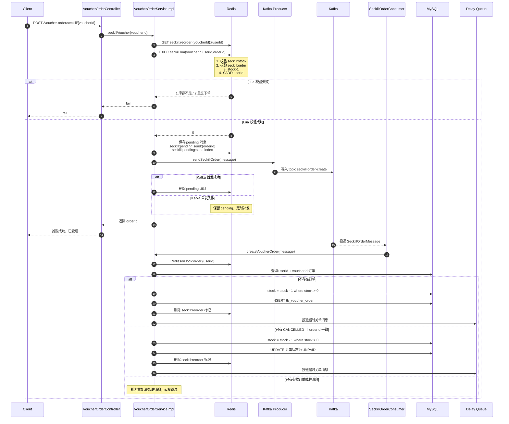

# Redis 与 Kafka 数据结构和秒杀主链路说明

这份文档主要回答 4 个问题：

1. 项目里 Redis 一共用了哪些数据类型
2. 每种数据类型的 key、用途、字段分别是什么
3. Kafka 里发送的消息字段有哪些
4. 秒杀主链路里 Redis + Kafka 是怎么串起来的

## 1. Redis 中使用的所有数据类型

### 1.1 String

#### `login:code:{phone}`
- 用途：登录验证码
- 值类型：字符串
- 值内容：6 位验证码
- 典型操作：`set`、`get`
- 代码位置：
  - [UserServiceImpl.java](/C:/Users/heyunhui/IdeaProjects/LivPick-db-cache-mq/src/main/java/com/livepick/service/impl/UserServiceImpl.java)

#### `cache:shop:{id}`
- 用途：店铺缓存
- 值类型：字符串
- 值内容有 3 种形态：
  - 店铺对象 JSON
  - 空字符串 `""`，表示缓存空值，用于防穿透
  - `RedisData` JSON，用于逻辑过期
- `RedisData` 字段：
  - `data`：真正的业务对象
  - `expireTime`：逻辑过期时间
- 典型操作：`get`、`set`
- 代码位置：
  - [CacheClient.java](/C:/Users/heyunhui/IdeaProjects/LivPick-db-cache-mq/src/main/java/com/livepick/utils/CacheClient.java)

#### `lock:shop:{id}`
- 用途：热点缓存重建时的互斥锁
- 值类型：字符串
- 值内容：固定 `"1"`
- 典型操作：`SETNX + EX`
- 说明：这是原生 `StringRedisTemplate` 实现的轻量锁，不带看门狗
- 代码位置：
  - [CacheClient.java](/C:/Users/heyunhui/IdeaProjects/LivPick-db-cache-mq/src/main/java/com/livepick/utils/CacheClient.java)

#### `seckill:stock:{voucherId}`
- 用途：秒杀券库存
- 值类型：字符串
- 值内容：剩余库存整数
- 典型操作：
  - `get`
  - `incrby -1`
  - `incrby +1`
- 代码位置：
  - [seckill.lua](/C:/Users/heyunhui/IdeaProjects/LivPick-db-cache-mq/src/main/resources/seckill.lua)
  - [seckill_rollback.lua](/C:/Users/heyunhui/IdeaProjects/LivPick-db-cache-mq/src/main/resources/seckill_rollback.lua)
  - [seckill_stock_rollback.lua](/C:/Users/heyunhui/IdeaProjects/LivPick-db-cache-mq/src/main/resources/seckill_stock_rollback.lua)

#### `seckill:reorder:{voucherId}:{userId}`
- 用途：记录“取消后可复用的原订单 ID”
- 值类型：字符串
- 值内容：`orderId`
- 典型操作：`get`、`set`、`delete`
- 代码位置：
  - [SeckillReservationService.java](/C:/Users/heyunhui/IdeaProjects/LivPick-db-cache-mq/src/main/java/com/livepick/service/SeckillReservationService.java)
  - [seckill_stock_rollback.lua](/C:/Users/heyunhui/IdeaProjects/LivPick-db-cache-mq/src/main/resources/seckill_stock_rollback.lua)

#### `seckill:pending:send:{orderId}`
- 用途：Kafka 首发失败时，保存待补发秒杀消息
- 值类型：字符串
- 值内容：`PendingSeckillOrderMessage` 的 JSON
- 字段：
  - `orderId`
  - `userId`
  - `voucherId`
  - `createTime`
  - `retryCount`
  - `nextRetryAt`
- 代码位置：
  - [PendingSeckillOrderMessage.java](/C:/Users/heyunhui/IdeaProjects/LivPick-db-cache-mq/src/main/java/com/livepick/mq/message/PendingSeckillOrderMessage.java)
  - [SeckillPendingSendService.java](/C:/Users/heyunhui/IdeaProjects/LivPick-db-cache-mq/src/main/java/com/livepick/service/SeckillPendingSendService.java)

#### `cache:delete:retry:{cacheKey}`
- 用途：删缓存失败时，保存待重试消息
- 值类型：字符串
- 值内容：`CacheDeleteRetryMessage` 的 JSON
- 字段：
  - `cacheKey`
  - `bizType`
  - `bizId`
  - `retryCount`
  - `nextRetryAt`
  - `lastError`
- 代码位置：
  - [CacheDeleteRetryMessage.java](/C:/Users/heyunhui/IdeaProjects/LivPick-db-cache-mq/src/main/java/com/livepick/mq/message/CacheDeleteRetryMessage.java)
  - [CacheDeleteRetryScheduleService.java](/C:/Users/heyunhui/IdeaProjects/LivPick-db-cache-mq/src/main/java/com/livepick/service/CacheDeleteRetryScheduleService.java)

#### `icr:{keyPrefix}:{yyyy:MM:dd}`
- 用途：全局 ID 生成器的日序列号
- 值类型：字符串
- 值内容：每天递增的序号
- 典型操作：`INCR`
- 代码位置：
  - [RedisIdWorker.java](/C:/Users/heyunhui/IdeaProjects/LivPick-db-cache-mq/src/main/java/com/livepick/utils/RedisIdWorker.java)

### 1.2 Hash

#### `login:token:{token}`
- 用途：登录用户会话信息
- 值类型：Hash
- 字段：
  - `id`
  - `nickName`
  - `icon`
- 值来源：`UserDTO`
- 典型操作：`putAll`、`entries`
- 代码位置：
  - [UserDTO.java](/C:/Users/heyunhui/IdeaProjects/LivPick-db-cache-mq/src/main/java/com/livepick/dto/UserDTO.java)
  - [UserServiceImpl.java](/C:/Users/heyunhui/IdeaProjects/LivPick-db-cache-mq/src/main/java/com/livepick/service/impl/UserServiceImpl.java)

### 1.3 Set

#### `seckill:order:{voucherId}`
- 用途：秒杀一人一单资格占用集合
- 值类型：Set
- 成员：`userId`
- 典型操作：
  - `SISMEMBER`：判断是否已经下过单
  - `SADD`：预占下单资格
  - `SREM`：订单失败或超时取消后释放资格
- 代码位置：
  - [seckill.lua](/C:/Users/heyunhui/IdeaProjects/LivPick-db-cache-mq/src/main/resources/seckill.lua)
  - [seckill_rollback.lua](/C:/Users/heyunhui/IdeaProjects/LivPick-db-cache-mq/src/main/resources/seckill_rollback.lua)
  - [seckill_stock_rollback.lua](/C:/Users/heyunhui/IdeaProjects/LivPick-db-cache-mq/src/main/resources/seckill_stock_rollback.lua)

#### `follows:{userId}`
- 用途：关注列表
- 值类型：Set
- 成员：被关注用户 ID
- 代码位置：
  - [FollowServiceImpl.java](/C:/Users/heyunhui/IdeaProjects/LivPick-db-cache-mq/src/main/java/com/livepick/service/impl/FollowServiceImpl.java)

### 1.4 ZSet

#### `blog:liked:{blogId}`
- 用途：博客点赞列表
- 值类型：ZSet
- member：`userId`
- score：点赞时间戳
- 代码位置：
  - [BlogServiceImpl.java](/C:/Users/heyunhui/IdeaProjects/LivPick-db-cache-mq/src/main/java/com/livepick/service/impl/BlogServiceImpl.java)

#### `feed:{userId}`
- 用途：粉丝收件箱
- 值类型：ZSet
- member：`blogId`
- score：推送时间戳
- 代码位置：
  - [BlogServiceImpl.java](/C:/Users/heyunhui/IdeaProjects/LivPick-db-cache-mq/src/main/java/com/livepick/service/impl/BlogServiceImpl.java)

#### `seckill:pending:send:index`
- 用途：待补发秒杀消息索引
- 值类型：ZSet
- member：`orderId`
- score：`nextRetryAt`
- 代码位置：
  - [SeckillPendingSendService.java](/C:/Users/heyunhui/IdeaProjects/LivPick-db-cache-mq/src/main/java/com/livepick/service/SeckillPendingSendService.java)

#### `cache:delete:retry:index`
- 用途：删缓存补偿消息索引
- 值类型：ZSet
- member：`cacheKey`
- score：`nextRetryAt`
- 代码位置：
  - [CacheDeleteRetryScheduleService.java](/C:/Users/heyunhui/IdeaProjects/LivPick-db-cache-mq/src/main/java/com/livepick/service/CacheDeleteRetryScheduleService.java)

### 1.5 GEO

#### `shop:geo:{typeId}`
- 用途：按店铺类型做附近店铺搜索
- 值类型：GEO
- member：`shopId`
- 坐标值：`longitude`、`latitude`
- 代码位置：
  - [ShopServiceImpl.java](/C:/Users/heyunhui/IdeaProjects/LivPick-db-cache-mq/src/main/java/com/livepick/service/impl/ShopServiceImpl.java)

### 1.6 Bitmap

#### `sign:{userId}:{yyyyMM}`
- 用途：用户签到
- 值类型：Bitmap
- bit 位含义：
  - 第 `dayOfMonth - 1` 位表示当天是否签到
- 典型操作：
  - `SETBIT`
  - `BITFIELD`
- 代码位置：
  - [UserServiceImpl.java](/C:/Users/heyunhui/IdeaProjects/LivPick-db-cache-mq/src/main/java/com/livepick/service/impl/UserServiceImpl.java)

## 2. Redisson 特殊结构

严格来说，下面这两类不是 Redis 原生数据类型概念，而是 Redisson 基于 Redis 封装出来的高级结构。

### 2.1 RBloomFilter

#### `bf:shop:id`
- 用途：店铺 ID 布隆过滤器，防缓存穿透
- 元素内容：`shopId`
- 核心参数：
  - `expectedInsertions`
  - `falseProbability`
- 代码位置：
  - [ShopBloomFilterService.java](/C:/Users/heyunhui/IdeaProjects/LivPick-db-cache-mq/src/main/java/com/livepick/service/ShopBloomFilterService.java)

### 2.2 RDelayedQueue + RBlockingDeque

#### `order:timeout:queue`
- 用途：未支付订单超时自动关单
- 结构：
  - `RDelayedQueue<String>`：延迟投递
  - `RBlockingDeque<String>`：到期后消费
- 队列里存的是 `OrderTimeoutMessage` JSON
- 字段：
  - `orderId`
  - `userId`
  - `voucherId`
  - `expireAt`
- 代码位置：
  - [OrderTimeoutMessage.java](/C:/Users/heyunhui/IdeaProjects/LivPick-db-cache-mq/src/main/java/com/livepick/mq/message/OrderTimeoutMessage.java)
  - [OrderTimeoutDelayQueueManager.java](/C:/Users/heyunhui/IdeaProjects/LivPick-db-cache-mq/src/main/java/com/livepick/mq/delay/OrderTimeoutDelayQueueManager.java)

## 3. Kafka 发送的消息字段

### 3.1 秒杀异步下单消息 `SeckillOrderMessage`

- topic：`seckill-order-create`
- key：`orderId`
- value：`SeckillOrderMessage` JSON
- 字段：
  - `orderId`
  - `userId`
  - `voucherId`
  - `createTime`
- 代码位置：
  - [SeckillOrderMessage.java](/C:/Users/heyunhui/IdeaProjects/LivPick-db-cache-mq/src/main/java/com/livepick/mq/message/SeckillOrderMessage.java)
  - [LivPickKafkaProducer.java](/C:/Users/heyunhui/IdeaProjects/LivPick-db-cache-mq/src/main/java/com/livepick/mq/producer/LivPickKafkaProducer.java)

### 3.2 缓存删除补偿消息 `CacheDeleteRetryMessage`

- topic：`cache-shop-delete-retry`
- key：`cacheKey`
- value：`CacheDeleteRetryMessage` JSON
- 字段：
  - `cacheKey`
  - `bizType`
  - `bizId`
  - `retryCount`
  - `nextRetryAt`
  - `lastError`
- 代码位置：
  - [CacheDeleteRetryMessage.java](/C:/Users/heyunhui/IdeaProjects/LivPick-db-cache-mq/src/main/java/com/livepick/mq/message/CacheDeleteRetryMessage.java)
  - [LivPickKafkaProducer.java](/C:/Users/heyunhui/IdeaProjects/LivPick-db-cache-mq/src/main/java/com/livepick/mq/producer/LivPickKafkaProducer.java)

## 4. 秒杀主链路里 Redis + Kafka 的完整时序图

## 5. 取消与回补链路

秒杀主链路之外，项目还补了超时关单后的库存与资格回补：

1. 延迟队列到期后，或者低频 Spring Task 扫描到超时订单
2. 先用数据库乐观更新把订单从 `UNPAID` 改成 `CANCELLED`
3. 数据库库存 `+1`
4. 执行 `seckill_stock_rollback.lua`

这个 Lua 会做 3 件事：
- `incrby seckill:stock:{voucherId} 1`
- `srem seckill:order:{voucherId} userId`
- `set seckill:reorder:{voucherId}:{userId} orderId`

这样就能保证：
- 库存恢复
- 用户抢购资格恢复
- 下次再抢时可以复用原订单 ID

相关代码：
- [OrderTimeoutServiceImpl.java](/C:/Users/heyunhui/IdeaProjects/LivPick-db-cache-mq/src/main/java/com/livepick/service/impl/OrderTimeoutServiceImpl.java)
- [SeckillReservationService.java](/C:/Users/heyunhui/IdeaProjects/LivPick-db-cache-mq/src/main/java/com/livepick/service/SeckillReservationService.java)

## 6. 关于“为什么分布式锁看起来还是 String 类型”

这个问题要分开看，项目里实际有两类锁。

### 6.1 秒杀订单锁：已经是 Redisson `RLock`

秒杀异步创建订单时，当前真正用的是：

- `redissonClient.getLock("lock:order:" + userId)`
- `tryLock()`

也就是说：
- 锁的业务实现是 Redisson
- `lock:order:` 只是 Redis key 前缀是字符串，并不代表这是 `StringRedisTemplate` 手写锁

代码位置：
- [VoucherOrderServiceImpl.java](/C:/Users/heyunhui/IdeaProjects/LivPick-db-cache-mq/src/main/java/com/livepick/service/impl/VoucherOrderServiceImpl.java)

### 6.2 这个订单锁是否带看门狗

是带的。

原因是当前调用的是：

- `tryLock()`

而不是：

- `tryLock(waitTime, leaseTime, unit)`

在 Redisson 里，如果没有显式传 `leaseTime`，就会使用默认 watchdog 机制自动续期。当前项目的 [RedissonConfig.java](/C:/Users/heyunhui/IdeaProjects/LivPick-db-cache-mq/src/main/java/com/livepick/config/RedissonConfig.java) 没有自定义 `lockWatchdogTimeout`，所以这里走的是 Redisson 默认行为，默认超时时间通常是 30 秒。

所以这条链路的正确表述是：

- 订单锁是 Redisson 分布式锁
- 默认启用了 watchdog 自动续期
- key 名虽然是字符串前缀，但锁语义不是“原生 String 手写锁”

### 6.3 为什么还有 `String` 类型锁

项目里确实还存在原生 Redis 字符串锁，主要有两处：

1. `CacheClient` 里的 `lock:shop:{id}`
   - 用来做热点缓存重建互斥
   - 实现方式是 `SETNX + EX 10s`
   - 不带看门狗

2. `SimpleRedisLock`
   - 这是一个早期手写锁工具类
   - 通过 `SETNX` 加锁，Lua 脚本解锁
   - 当前秒杀主链路没有在用它

### 6.4 为什么缓存锁没有统一改成 Redisson

当前实现里，缓存锁仍然保留为原生字符串锁，主要是因为这个临界区比较短：

- 只是在热点缓存重建时做一次互斥
- 正常情况下执行时间远小于 10 秒
- 用 `SETNX + EX` 实现更轻

但它的边界也很清楚：

- 没有 watchdog
- 如果缓存重建逻辑异常变慢，锁可能提前过期
- 严格来说鲁棒性不如 Redisson

所以如果继续工程化，我会这样做：

1. 订单锁继续保留 Redisson `RLock`
2. 缓存重建锁也可以统一迁移到 Redisson
3. 如果不迁移，至少把锁超时、异常日志和重建耗时监控补齐

## 7. 面试时可以怎么概括

可以直接这样说：

“这个项目里 Redis 不是只拿来做缓存，还承担了资格预占、库存扣减、待补发消息索引、缓存补偿索引、布隆过滤器、延迟队列这些职责。秒杀主链路里最关键的两个 Redis 结构是 `seckill:stock:{voucherId}` 和 `seckill:order:{voucherId}`，Lua 脚本会原子完成库存校验、一人一单校验和资格预占；通过 Kafka 把成功请求异步化后，再由消费者在 Redisson 用户锁保护下完成最终落库。订单锁这条链路已经是 Redisson `RLock`，带默认 watchdog；只有缓存重建锁还保留的是原生 String 锁实现。” 
